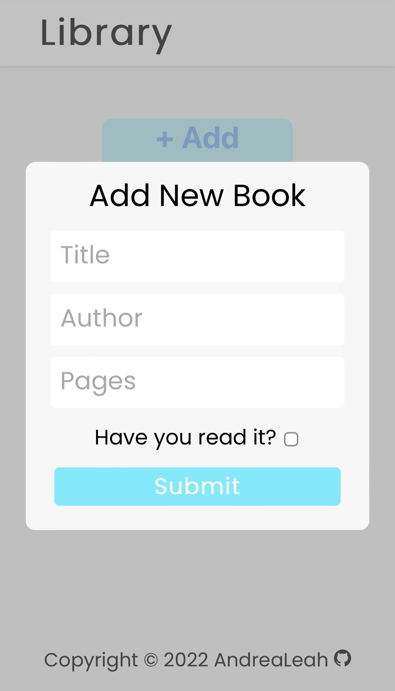
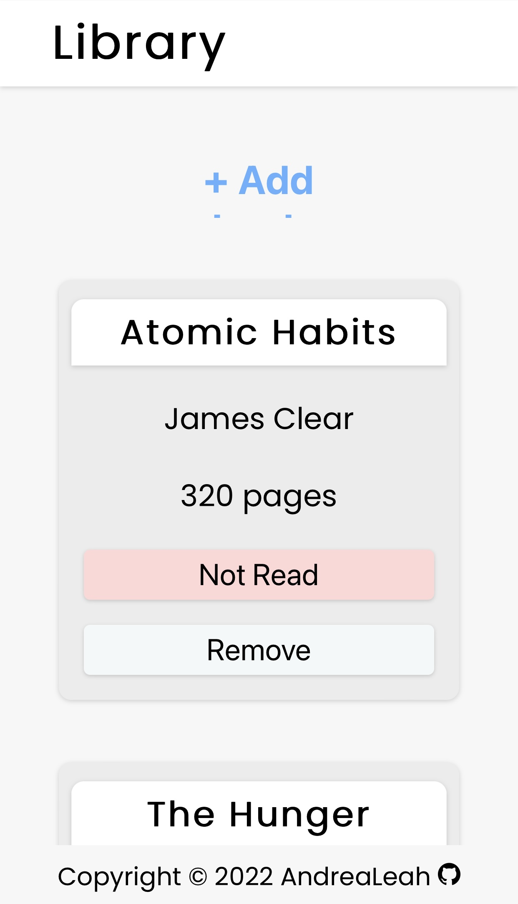
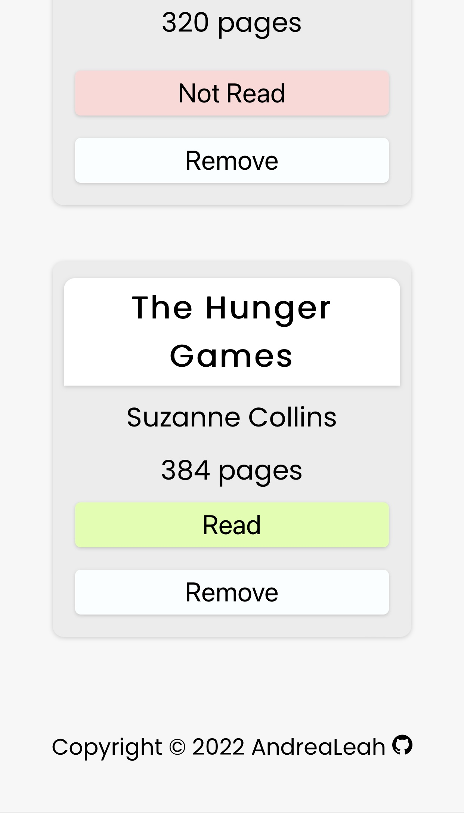
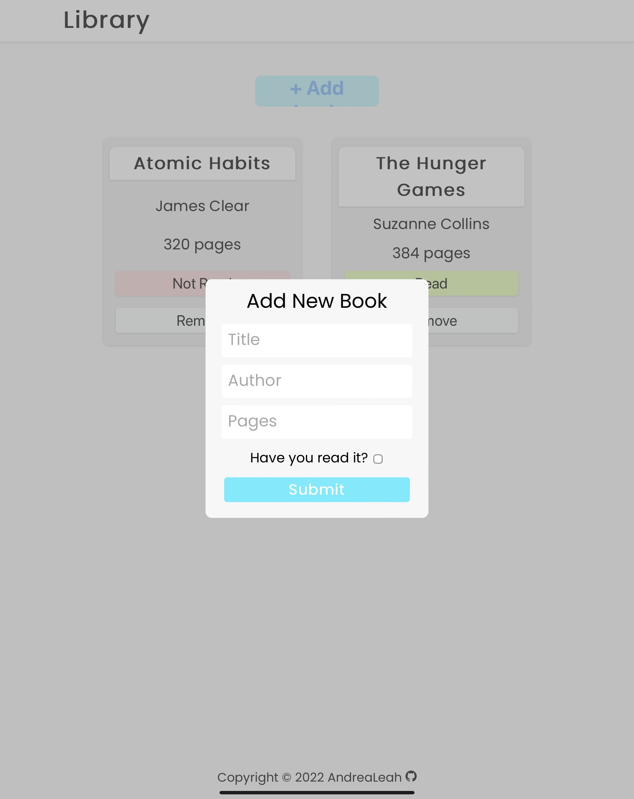

# library

**How To Use:**   

Click "Add book" to enter a new book into your library. Enter book information, and click the "submit" button.  

If you need to change the book's read status, click the "Read"/"Not Read" button. If you would like to remove a book from your bookshelf, simply click the "Remove" button.  

Your library is saved to your local storage, so you can leave and come back to it.   

[Live Demo](https://andrealeah.github.io/library/)  
  

**iPhone and iPad UI**

 

 

**Attribution:**  
GitHub Icon created by Pixel Perfect - Flaticon, [source](https://www.flaticon.com/free-icons/github)
Favicon created by Freepik, [source](https://www.flaticon.com/free-icons/book)